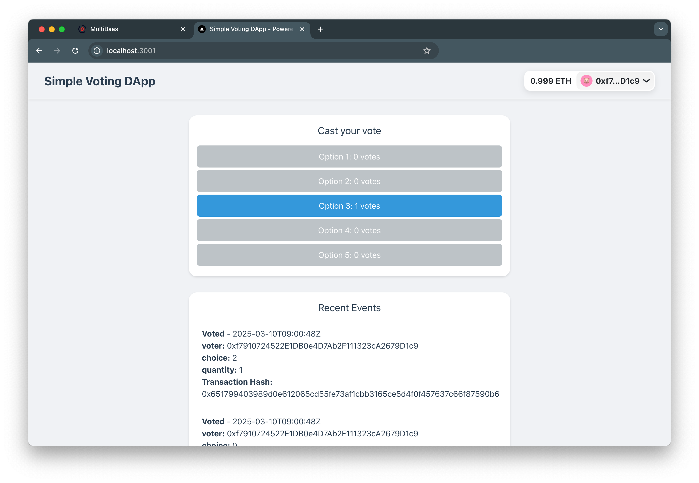

# RideRecords - Carfax on-chain for LATAM

A decentralized & tamper-evident history of used vehicles, built on Base, to reduce fraud and boost trust in P2P transactions.



## Overview

RideRecords is a web application that allows users to create a permanent, on-chain identity for a vehicle. Key events like registration and ownership transfer are anchored to the Base Sepolia blockchain, creating an immutable audit trail. The history is presented in a clean, easy-to-read timeline.

## Features

- **Vehicle Registration**: Register vehicles on-chain with VIN hashing for privacy
- **Ownership Transfer**: Transfer vehicle ownership with immutable blockchain records
- **Maintenance Records**: Add off-chain maintenance records with optional evidence uploads
- **History Timeline**: View complete vehicle history with on-chain verification links
- **Demo Mode**: Explore the app without connecting a wallet

## Quickstart Guide

### Prerequisites

You will need a few things to get started. Do this *before* running npm install.

1. Go to [console.curvegrid.com](https://console.curvegrid.com), sign up, and create a MultiBaas deployment on Base Sepolia network.
2. Go to Admin > API Keys > New Key and create a key with label "ride_records_admin" and select "Administrators". Copy and save the **API key** and **deployment URL**.
3. Go to [cloud.reown.com](http://cloud.reown.com/), sign up, create a new project with name "RideRecords", select product "Wallet Kit" and platform "JavaScript". Copy and save the **Project ID**.

### Installation

```sh
git clone <repository-url>
cd multibaas-sample-app
npm install
```

Follow the prompts during installation to configure your MultiBaas deployment.

### Deploy Smart Contract

```sh
cd blockchain
npm run deploy:riderecords:dev
```

### Run the Application

```sh
cd frontend
npm run dev
```

The application will be available at http://localhost:3000.

## Architecture

### Smart Contract (`RideRecords.sol`)

A minimal contract focused on anchoring key events:

- `registerVehicle(bytes32 serialHash)`: Registers a new vehicle
- `transferVehicle(bytes32 serialHash, address to)`: Transfers ownership
- `getVehicleOwner(bytes32 serialHash)`: Gets current owner

### Frontend

- **Next.js**: React framework with API routes
- **MultiBaas SDK**: Blockchain interaction
- **RainbowKit**: Wallet connection
- **Tailwind CSS**: Styling

### Backend (API Routes)

- `POST /api/vehicles`: Register new vehicle
- `GET /api/vehicles/[serialHash]`: Get vehicle details and history
- `POST /api/vehicles/[serialHash]/events`: Add maintenance record
- `POST /api/vehicles/[serialHash]/transfer`: Transfer ownership

## Environment Variables

Create a `.env.development` file in the `frontend` directory:

```env
NEXT_PUBLIC_RAINBOWKIT_PROJECT_ID=your_reown_project_id
NEXT_PUBLIC_MULTIBAAS_DEPLOYMENT_URL=https://your-deployment.multibaas.com
NEXT_PUBLIC_MULTIBAAS_DAPP_USER_API_KEY=your_dapp_user_api_key
NEXT_PUBLIC_MULTIBAAS_WEB3_API_KEY=your_web3_api_key
NEXT_PUBLIC_MULTIBAAS_RIDE_RECORDS_CONTRACT_LABEL=ride_records
NEXT_PUBLIC_MULTIBAAS_RIDE_RECORDS_ADDRESS_ALIAS=ride_records
NEXT_PUBLIC_MULTIBAAS_CHAIN_ID=84532
```

## Usage

### Register a Vehicle

1. Connect your wallet
2. Fill in vehicle details (VIN, Make, Model, Year, Odometer)
3. Submit the form to register on-chain
4. View the vehicle's history timeline

### Add Maintenance

1. Navigate to a vehicle you own
2. Click "Add Maintenance"
3. Enter description and optionally upload evidence
4. Submit to add to vehicle history

### Transfer Ownership

1. Navigate to a vehicle you own
2. Click "Transfer Ownership"
3. Enter recipient's wallet address
4. Confirm the on-chain transfer

### Demo Mode

1. Click "Try Demo" on the welcome screen
2. Explore the app with sample data
3. No wallet connection required

## Demo Script (90-Second Pitch)

1. **(5s) Intro**: "This is RideRecords, a Carfax on-chain to fight fraud in the used car market."
2. **(15s) Connect & Register**: "As a seller, I connect my wallet. I'll register my car by entering its details. The VIN is hashed for privacy, and we anchor it to the Base blockchain."
3. **(20s) View History**: "Now, any potential buyer can see the vehicle's history. Here's the registration event, immutably stored on-chain. I'll add a quick maintenance record, like an oil change, which is added to its off-chain history."
4. **(20s) Transfer**: "When I sell the car, I can transfer ownership directly on-chain. I'll enter the buyer's address... The timeline instantly updates with the new owner and another on-chain proof."
5. **(10s) Conclusion**: "By combining a fast off-chain database with the security of on-chain anchors, RideRecords creates a trusted, transparent, and fraud-resistant history for every vehicle."

## License

MIT License - see LICENSE file for details.
